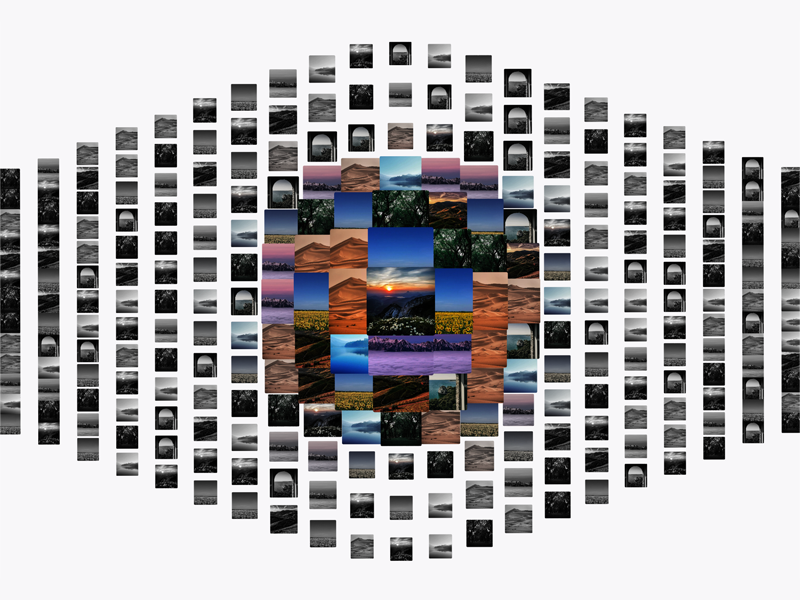

# Building an interactive image grid with Three.js

*Learn how to build and animate an interactive grid in Three.js without relying on an animation library*

[Article on Codrops](https://tympanus.net/codrops/?p=)

[Demo](https://tympanus.net/Development/.../)

## Installation

Run this demo on a [local server](https://developer.mozilla.org/en-US/docs/Learn/Common_questions/Tools_and_setup/set_up_a_local_testing_server).

## Credits

- Original concept - [Amin Ankward](https://x.com/Amin_Ankward)

## Misc

Follow *Author*: [Twitter](https://x.com/smljry), [GitHub](https://github.com/samueljarry)

Follow Codrops: [Bluesky](https://bsky.app/profile/codrops.bsky.social), [Facebook](http://www.facebook.com/codrops), [GitHub](https://github.com/codrops), [Instagram](https://www.instagram.com/codropsss/), [X](http://www.x.com/codrops)

## License
[MIT](LICENSE)

